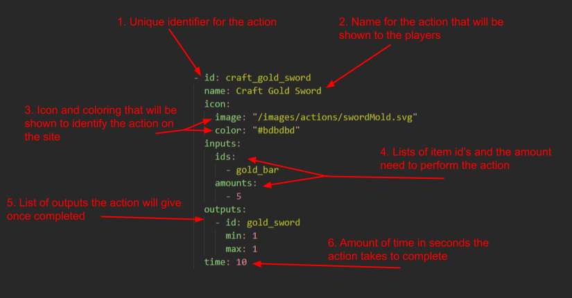

# Create Actions

## Anatomy of an Action



1. The `id` of an action is the unique identifier used when referencing the action internally (e.g. in the action registry or when queueing an action). The file name (e.g. `example_action.yaml`) must match the action `id`, following `snake_case`. Just like items, **make sure the `id` does not duplicate another action**, or the wrong action may be loaded or overwritten.

2. The `name` of the action is what players will see in the UI when browsing actions, crafting menus, or selecting tasks. Names do not need to be unique, but should be capitalized and descriptive.

3. Action Icon:

   * The `image` is the visual representation of the action, shown in action menus or tooltips. Like item icons, it should be a white SVG with no background so it can be recolored.
   * The `color` defines the tint applied to the icon (often useful for grouping: e.g. grey for smelting, yellow for crafting).

4. Inputs:

   * Defined under `inputs`, consisting of parallel arrays:
     **`ids`** (which items are consumed) and **`amounts`** (how many of each).
     These arrays must be the same length. The action system automatically consumes these items when the action starts.

5. Outputs:

   * Each output is defined as a `ChanceItem`.
     A `ChanceItem` includes:

     * `id`: the produced item
     * `min`: minimum amount
     * `max`: maximum amount
     * `chance` (optional): a denominator-based chance. If omitted or ≤1, the item always drops.

     Outputs are wrapped in an `items:` array when parsed into an `ActionOutput`.

6. `time` defines how many seconds the action takes to complete. This controls pacing and progression.

7. **Additional Notes**:

   * Multiple outputs can be defined, with or without chances (e.g. a rare drop).
   * Actions are grouped into categories (Mining, Crafting, Smelt, etc.) in the [`actionCategories` declaration](/src/lib/types/action.ts).

---

## Creating an Action

1. Create a `.yaml` file in the `/src/lib/actions/` folder, following `snake_case` like `example_action.yaml`.

2. Copy the example action below:

   ```yaml
   - id: example_action
     name: Example Action
     icon:
       image: "/images/actions/example.svg"
       color: "#ffffff"
     inputs:
       ids:
         - example_item_input
       amounts:
         - 1
     outputs:
       - id: example_item_output
         min: 1
         max: 1
     time: 10
   ```

3. Set the image path for the action icon. Follow the same icon guidelines described in [Anatomy of an Action](#anatomy-of-an-action): white SVG, transparent background, placed under `/static/images/actions/`.

4. Fill in the template:

   * Set a clear `id` that matches the filename
   * Choose a readable `name`
   * Define the `inputs` and `outputs`
   * Use `chance` on outputs only when necessary
   * Set an appropriate `time` value

5. Add the action's `id` to a new or existing group in the [`actionCategories` declaration](/src/lib/types/action.ts).

---

## How Actions Are Parsed

Actions are loaded using `import.meta.glob` and processed through `parseYAMLToAction`. Key behaviors:

* Only the **first document** in a YAML file is used.
* `outputs` in YAML are converted to `{ items: [...] }` internally.
* Missing `chance` values default to guaranteed drops.
* Action IDs match file names so the registry can auto-index them.

---

## Final Notes

* Use consistent iconography to help players mentally group actions.
  For example, all smelting actions might use metal-related SVGs with a similar color.
* Avoid ambiguous or overly generic action IDs such as `do_craft` or `create_item`. Prefer descriptive names like `example_action` only for testing or documentation.
* When creating many related actions (e.g. ore → bar → item), ensure the progression makes sense with `time`, `inputs`, and `outputs`.
