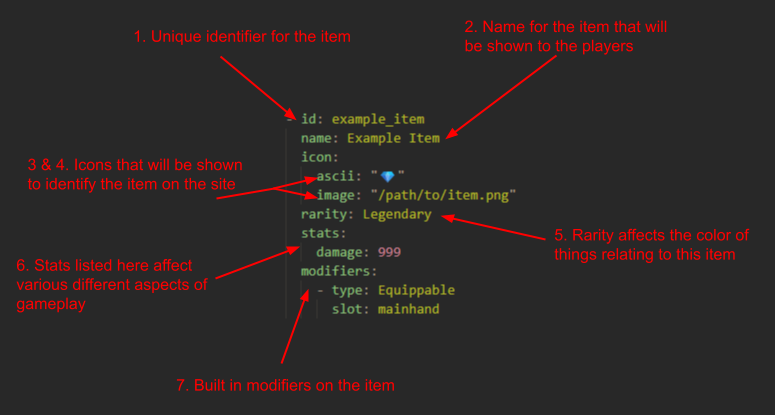

# Create Items

## Anatomy of an Item

1. The `id` of an item is the unique identifier of a base item. It is used to differentiate between items when encoding and decoding to and from the database. It is **very** important that you make sure the `id` of the new item does **not** match any other item `id`s, or else there will be issues with items getting overridden when loading player's inventories from the database. Generally the file name, e.g. `item_id.yaml` matches the `id` of the item. Item `id`s follow the `snake_case` naming convention
2.  The item's `name` is what will be shown to players when linking items in the chat or hovering over them in a player's inventory. Item `name`s do not need to be unique, but should be capitalized
3. Ascii Icon:
    - The `ascii` icon is the fallback from the `image` to be shown to players. The `ascii` icon should be indicative of what the item is, although this is up to personal interpretation
4. Image Icon:
    - The `image` icon is the first choice of what is shown to players. The `image` should be a white `svg` with no/a 0% background, allowing for the `image` to be recolored to match the item's rarity. To match styling use [game-icons.net](https://game-icons.net)
5. The `rarity` of the item affects the coloring of the `image` and `name`. The `rarity` must follow the enum as defined in the [item type declaration](/src/lib/types/item.ts). While `rarity` is currently a purely cosmetic attribute, this is subject to change, so keep that in mind when creating items. Use good decision making when setting the rarity of items, a wooden sword probably shouldn't be `Divine`
6. Base `stats` is an optional field, and sets the item's base `stats`. The stats available are included in the `Stats` export from the [stats type declaration](/src/lib/types/stats.ts)
7. The base modifiers for the item. All modifiers are available for use from the [modifier registry](/src/lib/modifiers/modifiersRegistry.ts). Adding modifiers is a more complex system and not recommended unless you know what you're doing

## Creating an item
1. Create a `.yaml` file in the `/src/lib/items` folder, following the `snake_case` naming convention
2. Copy the example item text from below:
    - ```yaml
        - id: example_item
          name: Example Item
          icon: 
            ascii: "💎"
            image: "/path/to/image.svg"
          rarity: Legendary
          stats:
            damage: 999
          modifiers:
            - type: Equippable
              slot: mainhand
        ```
3. Path to or place the desired image from the `/static/images/items/` folder. Following the image guidelines as described in [Anatomy of an Item](#anatomy-of-an-item)
4. Fill out the item template with the desired values

## Final Notes
- It is generally best practice to distinguish similar items e.g. `titanium_bar` and `hardened_titanium_bar` by some measure other than name. In this case, `titanium_bar` uses the `metalBar.svg` icon whereas `hardened_titanium_bar` uses `iBeam.svg`, seeing as their names are very similar and they are both `Rare` items